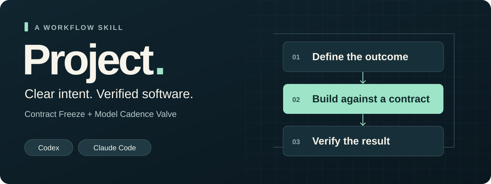
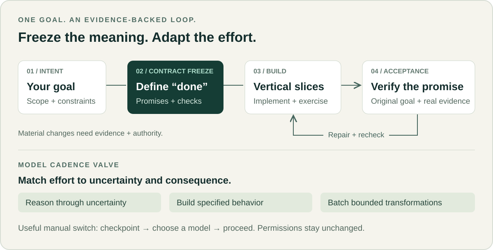

# Project

<picture>
  <source media="(max-width: 600px)" srcset="docs/assets/project-hero-mobile.svg">
  
</picture>

### Say what to build. Give the agent a clear definition of done.

Project is a reusable software-development skill for **Codex and Claude Code**. It turns
natural language or a specification into a focused contract, builds through working slices,
and checks the result against the original goal.

**Contract Freeze + Model Cadence Valve:** keep the product's promises stable while adapting
reasoning effort to the work that remains.

**[Install](#install)** · **[Start building](#core-usage)** · **[Read the docs](#advanced-configuration)** · **[View checks](https://github.com/bohselecta/OAI-Project-Skill/actions)**

**Version:** 1.2.0 public preview · **License:** [MIT](LICENSE)

Offline tests and cross-platform CI pass. Authenticated native-host discovery, real model
switching and model-backed behavioral trials remain **NOT_RUN**. See [validation evidence](docs/VALIDATION.md).

## Why Project

A clear goal is only the start. Project gives the development loop a durable definition of
success, a place to resume, and evidence you can inspect.

- **Keep the intended product intact.** Freeze goals, invariants and acceptance checks.
  Change the contract deliberately when new evidence or your direction requires it
- **Build something complete.** Prove the riskiest assumption early, then implement and
  verify vertical slices instead of stopping at a scaffold or a passing build
- **Use model effort where it helps.** Reason deeply about uncertainty, keep known work
  moving, and switch only when the benefit justifies the interruption
- **Resume with context.** Keep a compact checkpoint with the source revision, evidence,
  next action and remaining blockers
- **Know what was actually tested.** Separate live integrations from fixtures and mark
  unperformed checks honestly. Preserve permissions, unrelated work and cancellation

<picture>
  <source media="(max-width: 600px)" srcset="docs/assets/project-workflow-mobile.svg">
  
</picture>

The workflow scales down for a small fix. A substantial build gets traceable acceptance
checks and a distinct review against the contract. You retain control of consequential
decisions, credentials, spending and delivery permissions.

## Requirements

| What you need | When you need it |
| --- | --- |
| Codex, Claude Code, or a compatible skill-enabled agent with filesystem and execution access | Building software with Project |
| Python **3.10+** | Repository validation, Codex installation and release packaging |
| Node **22+** | Optional SayFrame verification/import and its test suite |
| Appropriate host tools, model access and permissions | The actual project you ask the agent to build |

The core skill is Markdown plus supporting references. It needs no daemon, hooks, API key
or paid model service of its own. The optional native SayFrame transport has separate setup.
On Windows, use `python` if `python3` is unavailable. Review a trusted, pinned revision before
installation; a local skill copy does not install into an unrelated web session.

## Install

Choose the host you use. Keep existing skill copies safe and avoid installing duplicate
personal and repository-scoped versions unnecessarily.

### Codex

From a reviewed checkout of this repository:

```bash
python3 scripts/project_tool.py validate
python3 -m unittest discover -s tests -v
python3 scripts/project_tool.py install --dry-run
python3 scripts/project_tool.py install
python3 scripts/project_tool.py status
```

This installs to **`~/.agents/skills/project`**. For a single product repository, add
`--repo /absolute/path/to/your-repo` to the install and status commands instead.

The installer refuses conflicting unmanaged directories and linked paths. It does not edit
global instructions, model settings or permissions. `status` checks installed bytes and
metadata; verify native discovery in your client separately.

**Prefer the agent to handle setup?** Open this trusted checkout in Codex and ask:

> Read INSTALL.md and install Project for this user. Inspect the package and existing
> destination, run validation and tests, and use the reversible installer. Preserve existing
> skills and settings. Report file validation separately from native discovery.

[Complete Codex installation and recovery guide →](INSTALL.md)

### Claude Code

Validate the generated package from the same reviewed checkout:

```bash
python3 scripts/build_claude_skill.py --check
python3 -m unittest discover -s tests -v
```

Copy the **complete** [`.claude/skills/project`](.claude/skills/project/SKILL.md) folder,
including its references and scripts, to one destination:

- **One product repository:** `<your-repo>/.claude/skills/project/`
- **Your local projects:** `~/.claude/skills/project/`

Do not copy over an existing folder. Inspect it and preserve a backup outside skill discovery
first. The [Claude guide](docs/CLAUDE-CODE.md#installation) includes a copyable, non-overwriting
Python installation snippet and update/recovery steps.

Start Claude Code in your product repository and check for **`/project`**. Restart if the
client has not detected the new skill. The Codex installer above targets Codex only.

[Complete Claude Code installation and usage guide →](docs/CLAUDE-CODE.md)

## Core usage

### Give Project an outcome

**Codex** uses `$project`:

```text
$project build a local-first research notebook with Markdown export
$project implement ./PRODUCT-SPEC.md end-to-end
$project finish this repository against its existing acceptance criteria
```

**Claude Code** uses `/project`:

```text
/project build a local-first research notebook with Markdown export
/project implement ./PRODUCT-SPEC.md end-to-end
/project finish this repository against its existing acceptance criteria
```

`Project: build …` also supports natural-language matching; it is not a registered command.
Provide the actual specification or a readable source. Review-only requests and quoted
examples do not authorize construction.

### Let the development loop run

For substantial work, Project normally keeps these records, or reuses your existing equivalents:

```text
.project/PROJECT-CONTRACT.md   The outcome, invariants and acceptance checks
.project/STATUS.md             Evidence, current state and the next action
.project/DECISIONS.md          Material amendments, only when needed
```

The agent inspects the repository, resolves reversible implementation choices, verifies each
slice and repairs in-scope failures. It asks when a consequential choice, missing input or
permission genuinely blocks progress. A small change does not need a new document system.

### Resume after a useful model switch

If another available model would materially help, Project saves a checkpoint and explains why.
Choose the model in your host, then reply **`proceed`**. In Claude Code, use `/model` and prefer
a session-only selection where available. If the current model is sufficient, keep working.

`proceed` resumes the checkpoint. It never grants new spending, publication, destructive
changes or deployment permissions. Project is a workflow skill, not an automatic model router.

## Advanced configuration

### Model policy and host guidance

Roles stay stable; model names can change. The dated [OpenAI model policy](skills/project/references/model-policy.json)
and [Claude model policy](.claude/skills/project/references/model-policy.json) are advisory.
They do not set host configuration, prove performance gains or establish account entitlement.

- [Model cadence and switching](skills/project/references/cadence.md)
- [Contract and checkpoint records](skills/project/references/records.md)
- [Acceptance and evidence](skills/project/references/acceptance.md)
- [Maintenance across model generations](docs/MAINTENANCE.md)

### SayFrame: accepted proposal to implementation

Develop the proposal in SayFrame, then give Project its complete accepted revision. File-based
intake verifies `proposal.md`, `handoff.json` and `CODEX-START.md`, including the action, target
and limits. An old approval field or a valid digest does not replace your current authorization.

The optional native Codex plugin adds read-only authenticated intake and a human-controlled
Proceed gate. Claude Code supports the file bundle; a `codex://` link is not a Claude launcher.

[SayFrame integration →](integrations/sayframe/README.md) · [Native Codex setup and limits →](docs/NATIVE-SAYFRAME.md)

### Updates, backups and distribution

Codex's installer supports reviewed replacement, uninstall-to-backup and restoration. Use the
same scope flags throughout. Claude installations use a preserved copy outside discovery
before replacement. Follow the host's installation guide rather than overwriting local changes.

To build both deterministic standalone packages and their checksums:

```bash
python3 scripts/build_release.py --out-dir dist/project-1.2.0
```

Use a new output directory. Successful CI runs also attach the two host ZIPs and `SHA256SUMS`.
A source version or CI artifact does not imply a GitHub Release or marketplace listing.

[Release preparation and artifacts →](docs/RELEASE.md) · [Plugin distribution →](docs/DISTRIBUTION.md)

## Project links

Built by **Hayden Lindley** and shared under the [MIT license](LICENSE).
Project is a community project and is not affiliated with or endorsed by OpenAI or Anthropic.

[Contributing](CONTRIBUTING.md) · [Security and privacy](SECURITY.md) · [Changelog](CHANGELOG.md) · [Design decisions](docs/DESIGN.md) · [Host evaluation guide](evals/README.md)

For non-sensitive bugs and suggestions, [open a repository issue](https://github.com/bohselecta/OAI-Project-Skill/issues).
Keep credentials and private project material out of issues and pull requests; follow the
security guide for sensitive reports.
